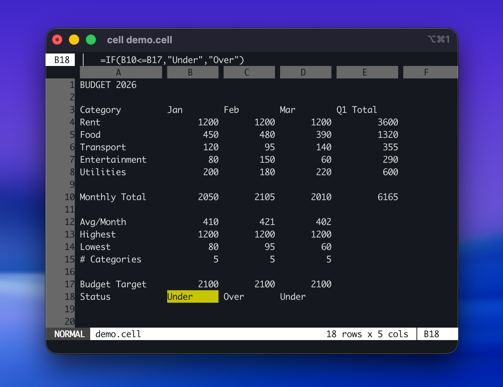

# cell

A terminal spreadsheet editor with Vim keybindings, written in Rust.



## Install

From [crates.io](https://crates.io/crates/cell-sheet-tui):

```sh
cargo install cell-sheet-tui
```

Pre-built binaries for Linux, macOS, and Windows are available on the [GitHub Releases](https://github.com/garritfra/cell/releases) page.

### Build from source

```sh
git clone https://github.com/garritfra/cell.git
cd cell
cargo build --release
# Binary at target/release/cell
```

## Usage

```sh
cell                    # empty sheet
cell data.csv           # open CSV
cell data.tsv           # open TSV
cell sheet.cell         # open native format
```

To explore an example sheet with formulas, ranges, and IF logic:

```sh
cell examples/demo.cell
```

## Keybindings

If you know Vim, you know cell.

### Normal Mode


| Key                 | Action                       |
| ------------------- | ---------------------------- |
| `h` `j` `k` `l`     | Move cursor                  |
| `gg`                | First row                    |
| `G`                 | Last row                     |
| `0`                 | First column                 |
| `$`                 | Last column                  |
| `Ctrl-D` / `Ctrl-U` | Half-page down/up            |
| `Ctrl-F` / `Ctrl-B` | Full page down/up            |
| `w` / `b`           | Next/previous non-empty cell |
| `i` / `a` / `Enter` | Edit cell (Insert mode)      |
| `x`                 | Clear cell                   |
| `dd`                | Delete row                   |
| `yy`                | Yank row                     |
| `p` / `P`           | Paste below/above            |
| `u`                 | Undo                         |
| `Ctrl-R`            | Redo                         |
| `v`                 | Visual selection             |
| `Ctrl-V`            | Visual block selection       |
| `/`                 | Search                       |
| `n` / `N`           | Next/previous match          |
| `:`                 | Command mode                 |


### Insert Mode

Type to edit the cell. `ESC` or `Enter` confirms.

### Visual Mode

Select with `hjkl`, then `y` to yank, `d` to delete.

### Commands


| Command        | Action                        |
| -------------- | ----------------------------- |
| `:w`           | Save                          |
| `:w file.csv`  | Save as CSV                   |
| `:w file.cell` | Save as native format         |
| `:w!`          | Force save (flatten formulas) |
| `:q`           | Quit                          |
| `:q!`          | Quit without saving           |
| `:wq`          | Save and quit                 |
| `:e file`      | Open file                     |
| `:sort A asc`  | Sort by column A ascending    |
| `:sort B desc` | Sort by column B descending   |


## Formulas

Formulas start with `=` and support Excel-compatible syntax:

```
=A1+B1
=SUM(A1:A10)
=AVERAGE(B1:B5)
=IF(A1>100, "high", "low")
```

### Supported Functions (v1)

`SUM`, `AVERAGE`, `COUNT`, `MIN`, `MAX`, `IF`

Formula compliance with the ODF (OpenDocument Formula) spec is tracked and will expand over time.

## File Formats

- **CSV/TSV** -- Opens and saves standard comma/tab-separated files. Formulas are flattened to their computed values on CSV export.
- `**.cell`** -- Native format that preserves formulas. Plain text, human-readable, inspired by [sc-im](https://github.com/andmarti1424/sc-im).

When saving a CSV that contains formulas, cell warns you and suggests saving as `.cell` instead. Use `:w!` to force a CSV save.

## Comparison with sc-im

[sc-im](https://github.com/andmarti1424/sc-im) is a battle-tested terminal spreadsheet built on the classic `sc` (Spreadsheet Calculator, 1981). It inspired cell's native `.cell` format. Here's how the two tools compare:

| | cell | sc-im |
| --- | --- | --- |
| **Language / TUI** | Rust + ratatui | C + ncurses |
| **Editing model** | True Vim modal editing (`i` → Insert, `ESC` → Normal) | Vim-inspired navigation; `=` to enter a value, `e`/`E` to edit |
| **Formula syntax** | Excel-compatible (`=SUM(A1:A10)`, `=IF(...)`) | `@`-prefix style (`@sum(A1:A10)`, `@avg(...)`) |
| **Built-in functions** | SUM, AVERAGE, COUNT, MIN, MAX, IF | Extensive (@sum, @avg, @min, @max, @abs, @sqrt, ...) |
| **File formats** | CSV, TSV, `.cell` | CSV, TSV, XLSX/XLS/ODS import, Markdown export, `.sc` |
| **Cell formatting** | not yet | Bold, italic, underline, RGB colors |
| **Scripting** | not yet | Lua scripting, external C modules, non-interactive mode |
| **Charting** | not yet | GNUPlot integration |
| **Windows support** | ✓ (pre-built binaries) | Limited |
| **Clipboard** | Built-in | Requires tmux / xclip / pbpaste |
| **Config file** | not yet | `~/.config/sc-im/scimrc` |

### Choose cell if…

- You want editing that works exactly like Vim (`i` to insert, `ESC` to return, `/` to search)
- You prefer Excel-compatible formula syntax (`=SUM`, `=IF`, `=AVERAGE`)
- You need a working binary on Windows without extra setup
- You value a modern, memory-safe codebase with minimal dependencies

### Choose sc-im if…

- You need XLSX, ODS, or Markdown support right now
- You need Lua scripting, GNUPlot charting, or non-interactive batch mode right now
- You need cell-level formatting (colors, bold, italic) right now
- You want a highly configurable, feature-rich tool with decades of history behind it

## Architecture

```
cell/
  crates/
    cell-sheet-core/    # Data model, formula engine, file I/O (no TUI dependency)
    cell-sheet-tui/     # Ratatui rendering, Vim modes, event loop
```

The core library is independent of the terminal UI and can be tested without a terminal.

## Releasing

1. Update the version in `[Cargo.toml](Cargo.toml)` (workspace version)
2. Update `[CHANGELOG.md](CHANGELOG.md)` with the new version's changes
3. Commit: `git commit -am "release: bump to vX.Y.Z"`
4. Tag and push:
  ```sh
   git tag vX.Y.Z
   git push origin main --tags
  ```

Pushing a `v*` tag triggers the [release workflow](.github/workflows/release.yml), which:

- Builds binaries for Linux (x86_64, aarch64), macOS (x86_64, aarch64), and Windows (x86_64)
- Creates a GitHub Release with the binaries attached
- Publishes `cell-sheet-core` and `cell-sheet-tui` to [crates.io](https://crates.io) via trusted publishing

## License

[MIT](LICENSE)